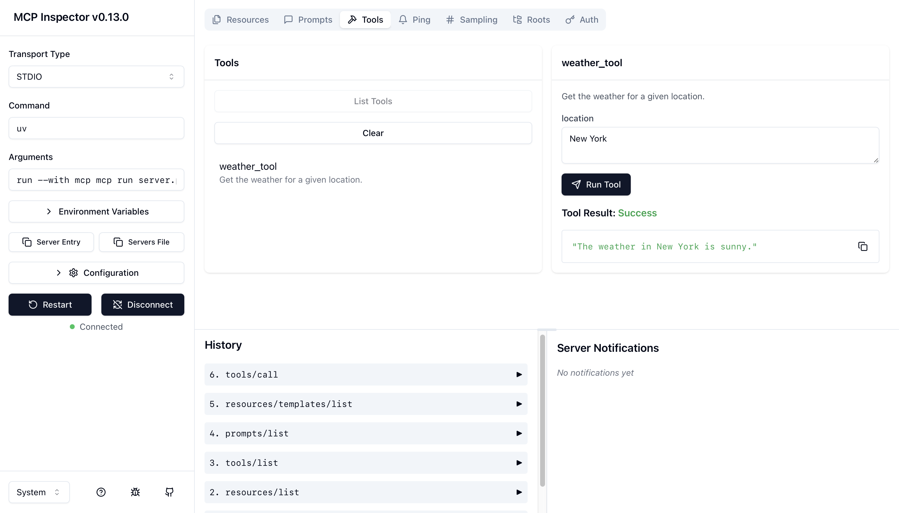

# Getting Started
This project used `uv` for package dependency management. Reference the official [site](https://docs.astral.sh/uv/) for installation details.

Recommended to create a virtual environment for the project:
```bash
uv venv
source .venv/bin/activate
```

To run the mcp server:
```bash
uv run mcp dev server.py
```

## Introduction
This repository is a hello-world example using `mcp[cli]` from Anthropic. Below we define the components from server-side used in this example:

**Tools**
Executable functions or actions that the model can invoke through the MCP protocol.
**Resources**
Provide read-only access to data sources, allowing the model to get context without executing complex logic.
**Prompts**
Pre-defined templates that guide the interaction between the user, model, and server capabilities.

### Error Handling
You might encounter ❌  MCP Inspector PORT IS IN USE at http://127.0.0.1:6274 ❌ when terminating the server and relaunching.

You may confirm the port 6277:

`sudo lsof -i :6277`
If a port is in use, find the PID of the process and kill it:

`kill -9 623862`

Additionally, check if their is a running python process for `mcp run` and kill it as well.

`ps aux | grep mcp`